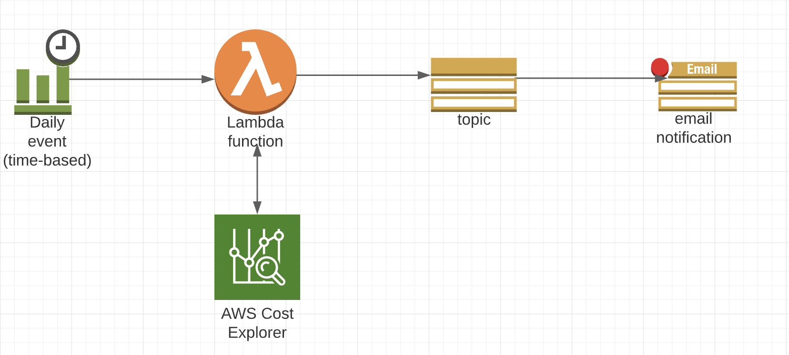

# Cost Reporting Solution

Publish command: 
dotnet publish --output "/Users/emmanuel.pius-ogiji/RiderProjects/CostReporting/src/CostReporting/bin/Release/netcoreapp3.1/publish" --configuration "Release" --framework "netcoreapp3.1" /p:GenerateRuntimeConfigurationFiles=true --runtime linux-x64 --self-contained false 

##CI Pipeline steps:
- Build
- Test
- Publish
- Terraform validate
- Terraform plan
- Terraform apply